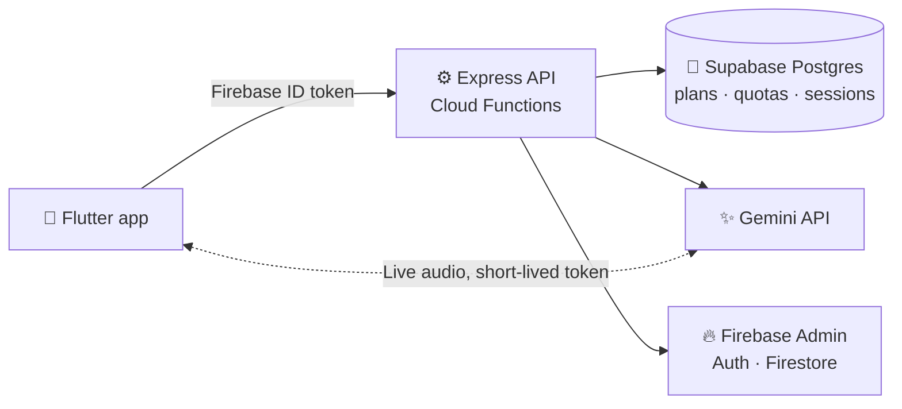

# 🌐 Context Translate API

**Backend for Context Translate & Flashcards**, an iOS app for AI translation, photo translation, live speech translation and AI vocabulary study.

## ✨ What it does

| | |
|---|---|
| 🔤 **Translation** | Text and photo text (read on the device) with Standard / Formal / Slang variants |
| 🎙️ **Live translation** | Short-lived Gemini Live tokens, so the API key never leaves the server; unused minutes are refunded |
| 🧠 **Study with AI** | 10-card tutoring sessions with answer checking, hints, resumable progress and a cooldown |
| 💳 **Plans & quotas** | Free / Standard / Premium + trials; daily limits, token buckets and time-based quotas, editable in the database |
| 🗑️ **Account deletion** | Removes database rows, synced data and the login |

## 🏗️ Architecture

## 🔒 Highlights

- **Server-enforced plans:** every request is authenticated with a Firebase ID token; limits are checked only on the server
- **Prompt-injection hardening:** user text is sent as data, replies follow a fixed JSON schema, the server verifies AI decisions
- **Race-safe:** row locks and optimistic concurrency, plus rate limits and input validation
- **Privacy first:** photos never leave the device; explicit consent before data goes to the AI provider

## Endpoints

| Method | Path | Purpose |
|---|---|---|
| `POST` | `/translate` | Text translation |
| `POST` | `/translate/photo` | Photo text translation + word list |
| `GET` | `/entitlements` | Plan and remaining quotas |
| `POST` | `/live/session` · `/live/session/end` | Start / end a Live session |
| `GET` `POST` | `/study` · `/study/start` · `/study/answer` | Study with AI |
| `DELETE` | `/account` | Delete the account |
